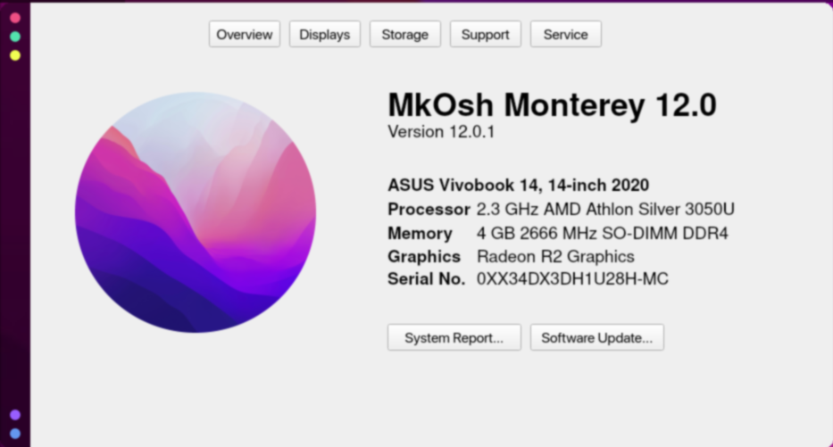

# MkAbout
Every MacOS has its own ABOUT THIS MAC page. If u saw my other projects, I have made a [MacOS Monterey](https://github.com/Mengo-Team/MkOsh) Config for my desktop carrying awesome wm. I decided to make one `About This Mac` app for myself, just to make it look cool and more familiar to Mac. I just love the new MacOS Monterey interface and am attempting to make my configs as similar to Mac as possible. Try the whole config too after it.



<br>

## ✨ Features

- Fits Perfect on my [MkOsh Monterey](https://github.com/Mengo-Team/MkOsh) theme
- Looks pretty similar to Mac
- Contains dummy information
- Works on only linux based systems
- Fast and reliable (Who cares tho?)

<br>

## ⚡️ Installation
### **For Linux users (ONLY LINUX USERS CAN USE IT):**

Now install depends on which shell you use

#### Bash Users:

```bash
curl https://raw.githubusercontent.com/Mengo-Team/MkAbout/master/bash_install.sh > minstall.sh;chmod +x ./minstall.sh;sudo bash ./minstall.sh
```

#### Fish Users:

```bash
curl https://raw.githubusercontent.com/Mengo-Team/MkAbout/master/fish_install.sh > minstall.sh;chmod +x ./minstall.sh;sudo fish ./minstall.sh
```

#### Zsh Users:

```bash
curl https://raw.githubusercontent.com/Mengo-Team/MkAbout/master/zsh_install.sh > minstall.sh; chmod +x ./minstall.sh;sudo zsh ./minstall.sh
```

<br>

## 💡 Usage
Just check your launcher/menu, the app will be there. 
